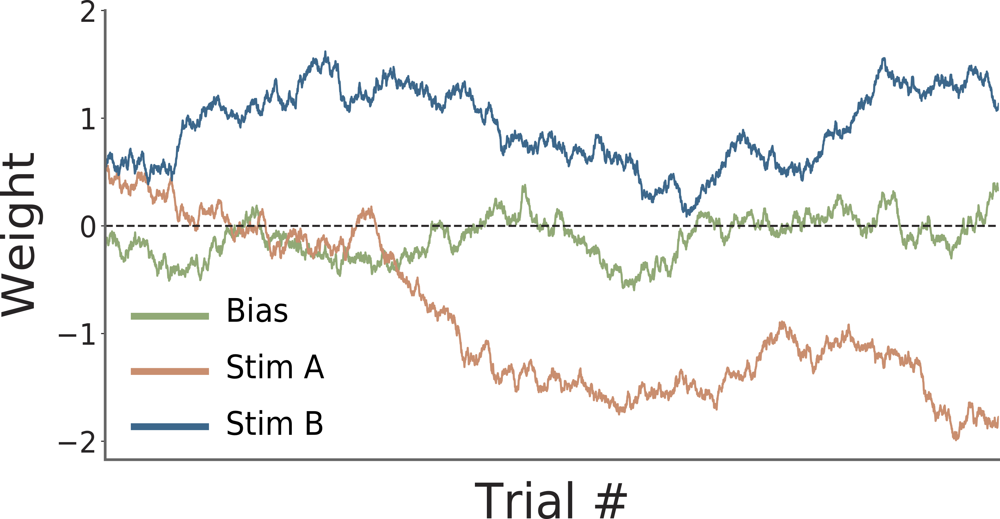

# PsyTrack

PsyTrack is a package for fitting a dynamic psychophysical model to behavioral data as proposed in our 2018 NeurIPS paper, "[Efficient inference for time-varying behavior during learning](http://pillowlab.princeton.edu/pubs/Roy18_NeurIPS_dynamicPsychophys.pdf)."

[//]: # ()

## Documentation

Documentation and examples can be found in [`ExampleNotebook.ipynb`](./psytrack/examples/ExampleNotebook.ipynb)

[//]: # ()

## How to install

Just run `pip install psytrack`

## Authors

Nick Roy, [Ji Hyun Bak](http://newton.kias.re.kr/~jhbak/), and [Jonathan Pillow](http://pillowlab.princeton.edu/)

Please cite as:

Roy, Nicholas A., et al. "Efficient inference for time-varying behavior during learning." _Advances in Neural Information Processing Systems_. 2018.

[//]: # (readme template from https://github.com/HIPS/autograd)
