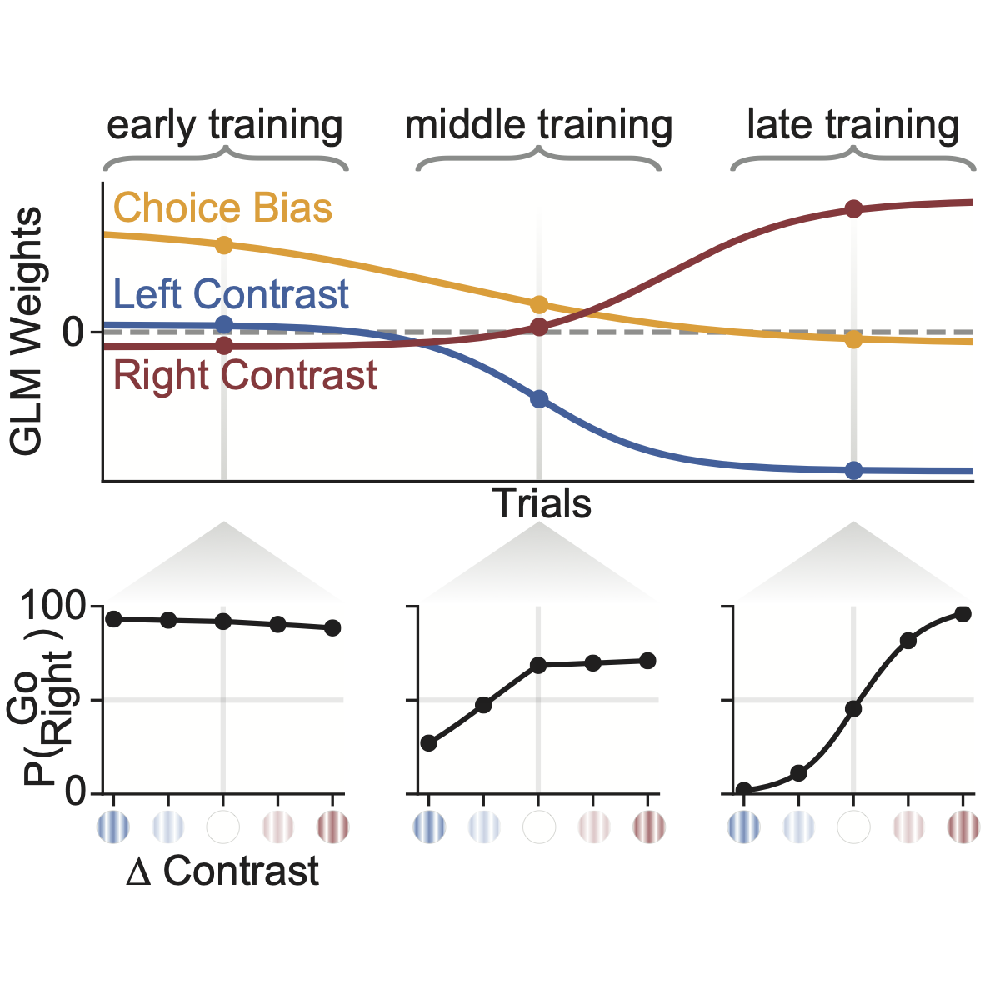

# PsyTrack

PsyTrack is a package for fitting a dynamic psychophysical model to behavioral data as described in our 2021 _Neuron_ paper, '[Extracting the dynamics of behavior in sensory decision-making experiments](https://authors.elsevier.com/a/1cMvC3BtfGx4U4).'

[//]: # ()

## Documentation

Documentation and examples can be found in [`ExampleNotebook.ipynb`](./psytrack/examples/ExampleNotebook.ipynb)

[//]: # ()

## How to install

Just run `pip install psytrack`

## Code authors

Nick Roy, [Ji Hyun Bak](http://newton.kias.re.kr/~jhbak/), and [Jonathan Pillow](http://pillowlab.princeton.edu/)

Please cite as:

Roy NA, Bak JH, Akrami A, The IBL, Brody CD, & Pillow JW, ["Extracting the dynamics of behavior in sensory decision-making experiments."](https://doi.org/10.1016/j.neuron.2020.12.004) _Neuron_ (2021).

[//]: # (readme template from https://github.com/HIPS/autograd)
